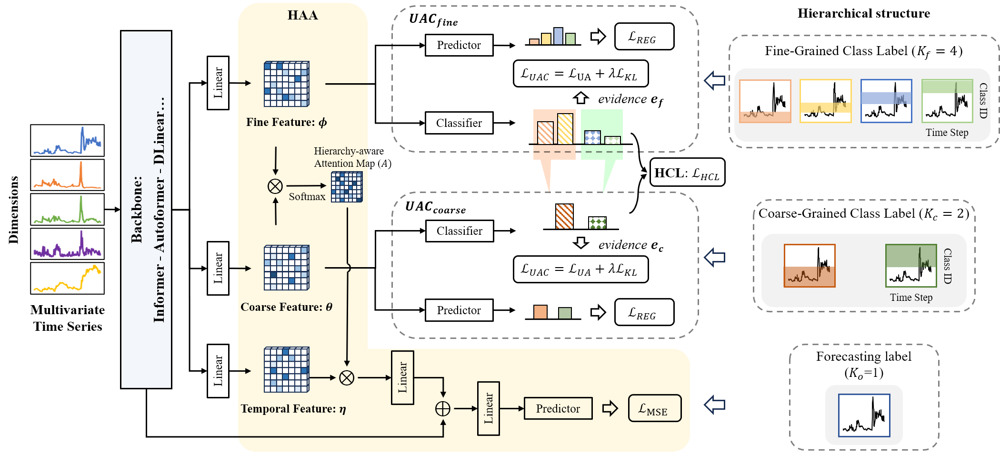

# Hierarchical Classification Auxiliary Network for Time Series Forecasting

[](https://arxiv.org/abs/2405.18975)  [](https://www.python.org/)  [](https://pytorch.org/)    

This code is the official PyTorch implementation of our AAAI'25 paper: [Hierarchical Classification Auxiliary Network for Time Series Forecasting](https://arxiv.org/abs/2405.18975).

🚩 News (2024.12) HCAN has been accepted by AAAI 2025.

## :sparkles: Abstract


Deep learning has significantly advanced time series forecasting through its powerful capacity to capture sequence relationships.
However, training these models with the Mean Square Error (MSE) loss often results in over-smooth predictions, making it challenging to handle the complexity and learn high-entropy features from time series data with high variability and unpredictability.
In this work, we introduce a novel approach by tokenizing time series values to train forecasting models via cross-entropy loss, while considering the continuous nature of time series data.
Specifically, we propose a **H**ierarchical **C**lassification **A**uxiliary **N**etwork, **HCAN**, a general model-agnostic component that can be integrated with any forecasting model.
HCAN is based on a Hierarchy-Aware Attention module that integrates multi-granularity high-entropy features at different hierarchy levels. 
At each level, we assign a class label for timesteps to train an Uncertainty-Aware Classifier. 
This classifier mitigates the over-confidence in softmax loss via evidence theory. We also implement a Hierarchical Consistency Loss to maintain prediction consistency across hierarchy levels. 
Extensive experiments integrating HCAN with state-of-the-art forecasting models demonstrate substantial improvements over baselines on several real-world datasets. 

## :sparkles: Datasets
You can obtain all the benchmarks from Google Drive (https://drive.google.com/drive/folders/1bG5kOK_CWWXyF6N6vAlfFzkXjmK7lanL). All the datasets are well pre-processed and can be used easily.

## :sparkles: How to Run the Code:

1. Install Python 3.6, PyTorch 1.9.0.
2. Install requirements. pip install -r requirements.txt
3. Train the model. We provide the experiment scripts of all benchmarks under the folder ./scripts. Now you can reproduce the experiment results by:

```javascript
sh ./scripts/ETTh1.sh
```

## :sparkling_heart: Acknowledgements

The codes in this repository are inspired by the following:

- Informer: https://github.com/zhouhaoyi/Informer2020
- PatchTST: https://github.com/yuqinie98/PatchTST
- E-NER: https://github.com/zhzhengit/ENER
- TMC: https://github.com/hanmenghan/TMC
- CoRe: https://github.com/yuxumin/CoRe
